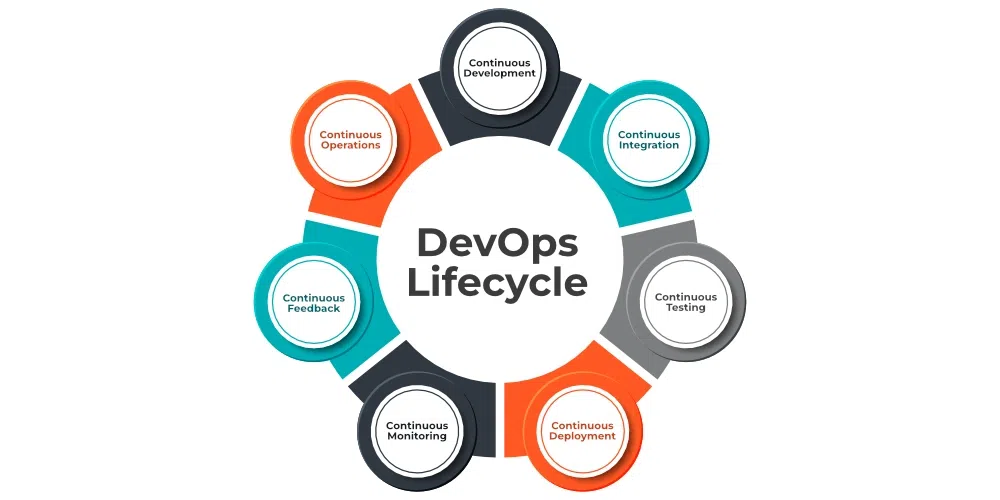
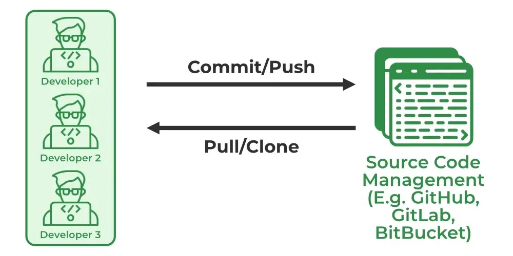
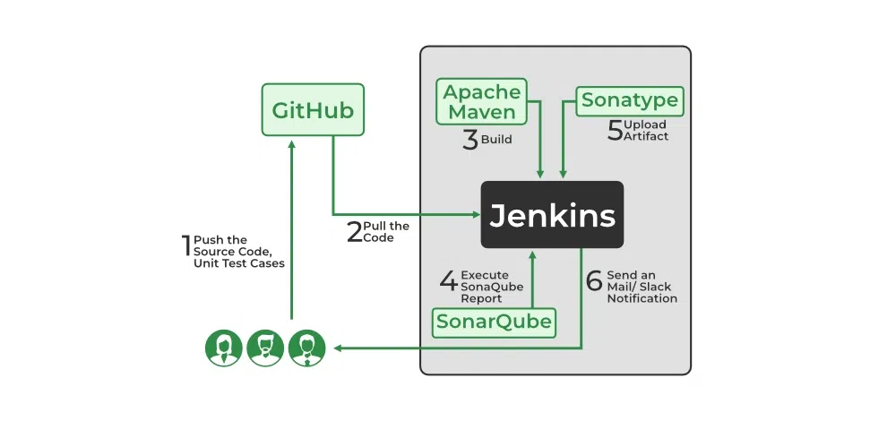

# DevOps-Introduction

DevOps is basically a combination of two words- *Development* and *Operations*. DevOps is a culture that implements the technology in order to promote collaboration between the developer team and the operations team to deploy code to production faster in an automated and repeatable way.

# Why DevOps?
The goal of DevOps is to increase an organization’s speed when it comes to delivering applications and services. Many companies have successfully implemented DevOps to enhance their user experience including Amazon, Netflix, etc.

Facebook’s mobile app which is updated every two weeks effectively tells users you can have what you want and you can have it. Now ever wondered how Facebook was able to do social smoothing? It’s the DevOps philosophy that helps Facebook ensure that apps aren’t outdated and that users get the best experience on Facebook. Facebook accomplishes this true code ownership model that makes its developers responsible that includes testing and supporting through production and delivery for each kernel of code. They write and update their true policies like this but Facebook has developed a DevOps culture and has successfully accelerated its development lifecycle.

Industries have started to gear up for digital transformation by shifting their means to weeks and months instead of years while maintaining high quality as a result.  The solution to all this is- DevOps.

# How DevOps is different from Traditional IT?
Traditional IT has 1000s lines of code and is created by different teams with different standards whereas DevOps is created by one team with intimate knowledge of the product. Traditional IT is complex to understand and DevOps is easily understandable.

# DevOps Lifecycle
DevOps lifecycle is the methodology where professional development teams come together to bring products to market more efficiently and quickly. The structure of the DevOps lifecycle consists of Plan, Code, Building, Test, Releasing, Deploying, Operating,  and Monitoring.

- **Plan:** Determining the commercial needs and gathering the opinions of end-user by professionals in this level of the DevOps lifecycle. 
- **Code:** At this level, the code for the same is developed and in order to simplify the design, the team of developers uses tools and extensions that take care of security problems.
- **Build:** After the coding part, programmers use various tools for the submission of the code to the common code source.
- **Test:** This level is very important to assure software integrity. Various sorts of tests are done such as user acceptability testing, safety testing, speed testing, and many more.
- **Release:** At this level, everything is ready to be deployed in the operational environment.
- **Deploy:** In this level, Infrastructure-as-Code assists in creating the operational infrastructure and subsequently publishes the build using various DevOps lifecycle tools.  
- **Operate:** At this level, the available version is ready for users to use. Here, the department looks after the server configuration and deployment.
- **Monitor**: The observation is done at this level that depends on the data which is gathered from consumer behavior, the efficiency of applications, and from various other sources.

# Advantages:
- **Faster Delivery:** DevOps enables organizations to release new products and updates faster and more frequently, which can lead to a competitive advantage.
- **Improved Collaboration:** DevOps promotes collaboration between development and operations teams, resulting in better communication, increased efficiency, and reduced friction.
- **Improved Quality:** DevOps emphasizes automated testing and continuous integration, which helps to catch bugs early in the development process and improve the overall quality of software.
- **Increased Automation:** DevOps enables organizations to automate many manual processes, freeing up time for more strategic work and reducing the risk of human error.
- **Better Scalability:** DevOps enables organizations to quickly and efficiently scale their infrastructure to meet changing demands, improving the ability to respond to business needs.
- **Increased Customer Satisfaction:** DevOps helps organizations to deliver new features and updates more quickly, which can result in increased customer satisfaction and loyalty.
- **Improved Security:** DevOps promotes security best practices, such as continuous testing and monitoring, which can help to reduce the risk of security breaches and improve the overall security of an organization’s systems.
- **Better Resource Utilization:** DevOps enables organizations to optimize their use of resources, including hardware, software, and personnel, which can result in cost savings and improved efficiency.

# Software Development Lifecycle

the SDLC is the set of phases that includes DevOps for taking part in Development and Operation group duties for quicker software program delivery. DevOps follows positive techniques that consist of code, building, testing, releasing, deploying, operating, displaying, and planning. DevOps lifecycle follows a range of phases such as non-stop development, non-stop integration, non-stop testing, non-stop monitoring, and non-stop feedback.
# 7 Cs of DevOps 
1. Continuous Development
2. Continuous Integration
3. Continuous Testing
4. Continuous Deployment/Continuous Delivery
5. Continuous Monitoring
6. Continuous Feedback
7. Continuous Operations

# 1. Continuous Development
In Continuous Development code is written in small, continuous bits rather than all at once, Continuous Development is important in DevOps because this improves efficiency every time a piece of code is created, it is tested, built, and deployed into production. Continuous Development raises the standard of the code and streamlines the process of repairing flaws, vulnerabilities, and defects. It facilitates developers’ ability to concentrate on creating high-quality code.

# 2. Continuous Integration 
- Continuous Integration can be explained mainly in 4 stages in DevOps. They are as follows:
- Getting the SourceCode from SCM
- Building the code
- Code quality review
- Storing the build artifacts
  
The stages mentioned above are the flow of Continuous Integration and we can use any of the tools that suit our requirement in each stage and of the most popular tools are Git- GitHub/BitBucket for source code management(SCM) when the developer develops the code on his local machine he pushes it to the remote repository which is GitHub from here who is having the access can Pull, clone and can make required changes to the code. From there by using Maven/Ant/Graddle we can build them into the required package (war, jar, ear) and can test the Junit cases.SonarQube performs code quality reviews where it will measure the quality of source code and generates a report in the form of HTML or PDF format. Nexus for storing the build artifacts will help us to store the artifacts that are build by using Maven and this whole process is achieved by using a Continuous Integration tool Jenkins/CircleCi/GitHubActions/AWSCodePipeline.

