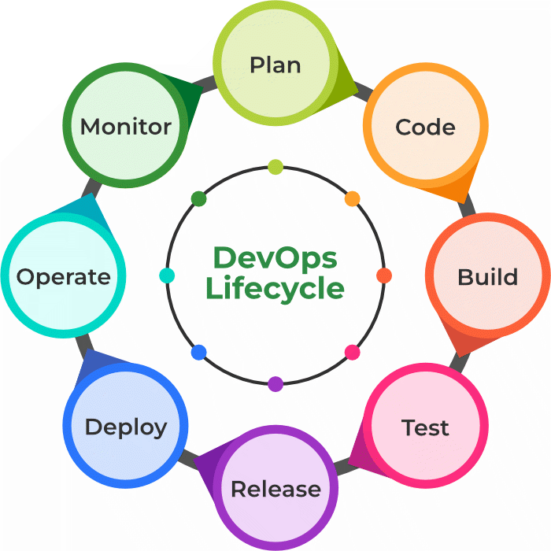

# DevOps-Introduction

DevOps is basically a combination of two words- *Development* and *Operations*. DevOps is a culture that implements the technology in order to promote collaboration between the developer team and the operations team to deploy code to production faster in an automated and repeatable way.

# Why DevOps?
The goal of DevOps is to increase an organization’s speed when it comes to delivering applications and services. Many companies have successfully implemented DevOps to enhance their user experience including Amazon, Netflix, etc.

Facebook’s mobile app which is updated every two weeks effectively tells users you can have what you want and you can have it. Now ever wondered how Facebook was able to do social smoothing? It’s the DevOps philosophy that helps Facebook ensure that apps aren’t outdated and that users get the best experience on Facebook. Facebook accomplishes this true code ownership model that makes its developers responsible that includes testing and supporting through production and delivery for each kernel of code. They write and update their true policies like this but Facebook has developed a DevOps culture and has successfully accelerated its development lifecycle.

Industries have started to gear up for digital transformation by shifting their means to weeks and months instead of years while maintaining high quality as a result.  The solution to all this is- DevOps.

# How DevOps is different from Traditional IT?
Traditional IT has 1000s lines of code and is created by different teams with different standards whereas DevOps is created by one team with intimate knowledge of the product. Traditional IT is complex to understand and DevOps is easily understandable.

# DevOps Lifecycle
DevOps lifecycle is the methodology where professional development teams come together to bring products to market more efficiently and quickly. The structure of the DevOps lifecycle consists of Plan, Code, Building, Test, Releasing, Deploying, Operating,  and Monitoring.

